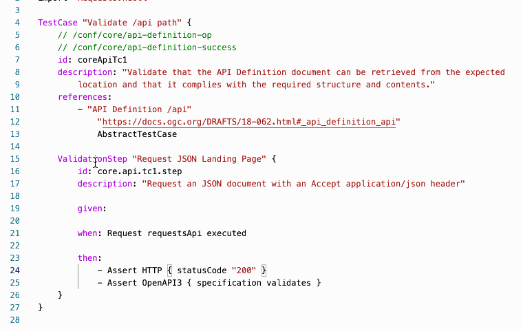
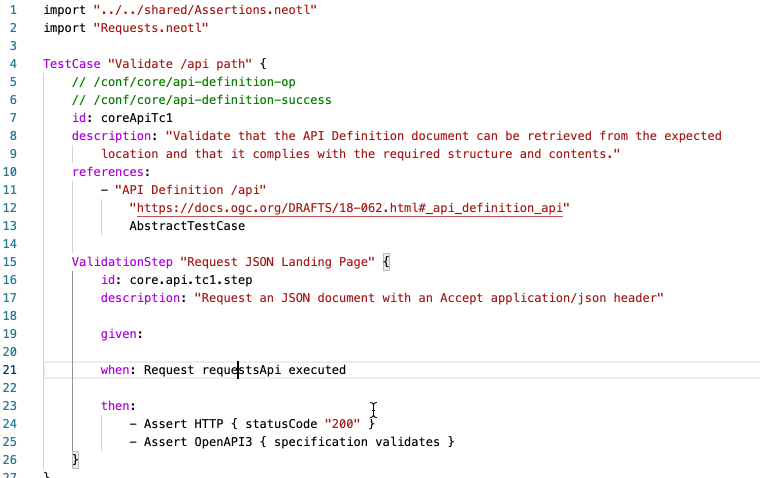
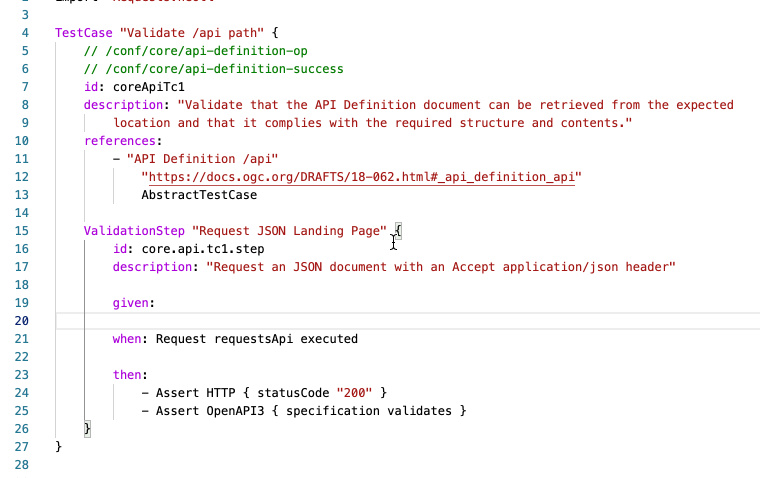

## IDE Services

### Hover Help

Hover the mouse cursor over individual items to get additional help.

### Code Navigation

Navigate to defintion by pressing **Ctrl** (**Command** on MacOS) and click on the Defintion.

### Show Definition

Display a definition by holding **Ctrl** (**Command** on MacOS) while hovering the mouse pointer over the definition.

### Suggestions

Get context-dependent suggestions in the DSL by pressing **Ctrl** (**Command** on MacOS) + **Space**.

In some cases, this can take quite a long time. Will be optimized in future versions.

### Validations

At the moment the following concepts are validated:

- Variables
- Links in resources
- URLs in schema validation definitions
- Stubs

Will be described in more detail soon.

### Coloring

Will be described in more detail soon.

### Outline

The Outline view is shown on the right side and gives an overview of the concepts in the current file. Depending on the concept, additional information is added.

Will be described in more detail soon.

### Snippets

Press **Ctrl** (**Command** on MacOS) + **Space** and select "New ..." from the context menu.

Will be described in more detail soon.

### Quick Actions

**Not yet implemented.**

### Formatting

**Not yet implemented.**
